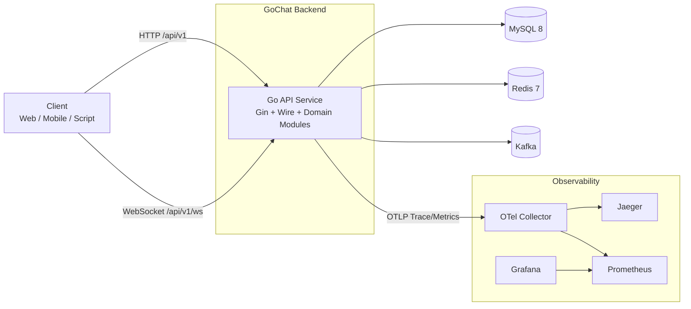
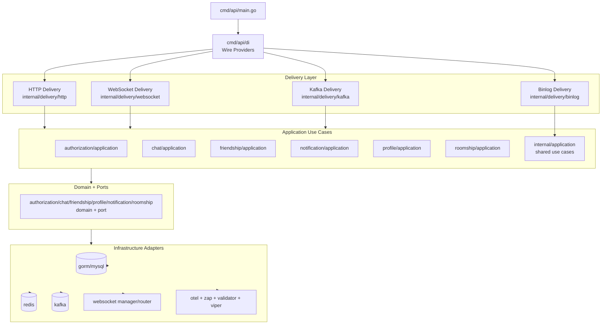
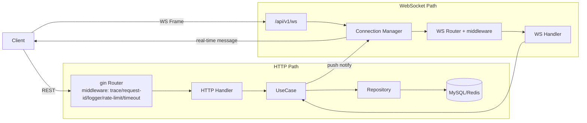
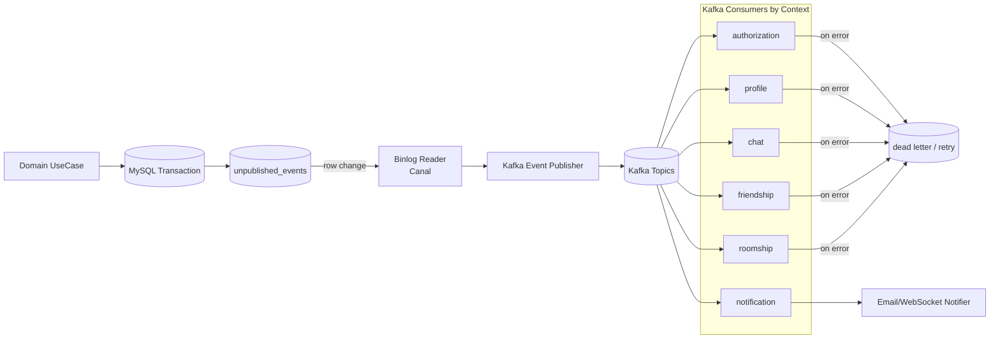

# GoChat Backend

## 项目介绍

GoChat Backend 是一个面向即时通讯场景的后端服务，提供用户认证、好友关系、房间管理、消息收发、通知等核心能力。

项目采用领域化分层设计（`internal/*` 按业务域拆分），支持：

- RESTful API（HTTP）
- 实时消息通道（WebSocket）
- 事件驱动处理（Kafka + MySQL Binlog）
- 可观测性链路（Tracing / Metrics / Logging）

默认 API 前缀为 `/api/v1`，并内置 Swagger 文档与健康检查接口，便于本地开发和联调。

## 核心技术栈

- **语言与运行时**: Go `1.24`
- **Web 框架**: Gin
- **依赖注入**: Google Wire
- **配置管理**: Viper + dotenv
- **数据存储**: MySQL 8 + GORM
- **缓存**: Redis 7
- **消息队列**: Kafka (Apache 官方镜像 `apache/kafka`)
- **实时通信**: Gorilla WebSocket
- **服务治理**: 限流（Redis）、超时控制、断路器（gobreaker）
- **可观测性**: OpenTelemetry + Jaeger + Prometheus + Grafana
- **日志**: Zap（终端输出）
- **API 文档**: Swaggo (Swagger)
- **容器化与编排**: Docker + Docker Compose
- **数据库迁移**: Goose

## 核心亮点

1. **领域化分层清晰**
   - 按 `authorization/chat/friendship/profile/roomship/notification` 等业务域隔离。
   - 每个业务域遵循 `application/domain/infrastructure/port` 结构，便于维护与扩展。

2. **多通道通信能力**
   - HTTP 提供标准 RESTful API。
   - WebSocket 提供实时消息会话能力，适配 IM 高实时场景。

3. **事件驱动架构**
   - 引入 Kafka 进行事件发布与消费。
   - 结合 MySQL Binlog Reader 构建异步事件链路，降低业务耦合。

4. **完善的可观测性体系**
   - 通过 OTel 统一采集 Trace/Metric。
   - 可直接使用 Jaeger、Prometheus、Grafana 进行链路追踪与指标可视化。

5. **工程化与可运维性**
   - `Makefile` 集成构建、启动、测试、迁移、Swagger 生成等常用操作。
   - 提供分层 Docker Compose：核心链路（MySQL / Redis / Kafka / App）与可观测栈（OTel / Prometheus / Grafana / Jaeger）可按需组合启动。

## 最简快速体验（建议先走这一段）

如果你第一次接触本项目，建议先用 Docker Compose 跑通最小链路（无需先安装 Go/Make）。

### 1) 复制最小配置文件

```bat
copy .env.example .env
copy config\config.override.example.yaml config\config.override.yaml
copy config\config.local.example.yaml config\config.local.yaml
```

### 2) Compose 启动（无需 Make）

```bat
docker compose -f docker-compose.yml -p backend up -d --build mysql redis kafka kafka-init
docker compose -f docker-compose.yml -p backend run --rm --build migrate
docker compose -f docker-compose.yml -p backend up -d --build app
```

> 说明：这里把迁移单独拆成一次性任务显式执行，这样更容易确认成功/失败，也不会卡在 `service_completed_successfully` 的等待状态。
>
> 如需同时启动可观测栈（OTel/Jaeger/Prometheus/Grafana），请使用：
>
> ```bat
> docker compose -f docker-compose.yml -f docker-compose.observability.yml -p backend up -d --build mysql redis kafka kafka-init otel-collector jaeger prometheus grafana
> docker compose -f docker-compose.yml -f docker-compose.observability.yml -p backend run --rm --build migrate
> docker compose -f docker-compose.yml -f docker-compose.observability.yml -p backend up -d --build app
> ```

### 3) 确认容器与服务已就绪

```bat
docker compose -f docker-compose.yml -p backend ps
curl http://localhost:8080/healthz
curl http://localhost:8080/readyz
```

当 `app` 容器状态为 `Up`，且 `healthz/readyz` 可访问时，可认为后端已正确启动。

### 4) 打开接口文档开始体验

- Swagger: `http://localhost:8080/swagger/index.html`
- API Base: `http://localhost:8080/api/v1`

如果启动失败，可先看应用容器输出：

```bat
docker compose -f docker-compose.yml -p backend logs app
```

## 快速启动

### 1) 环境准备

建议安装：

- Docker Desktop（含 Docker Compose）
- GNU Make（如需使用 `make` 命令）
- Go 1.24（仅本地裸跑或开发调试时需要）

### 2) 初始化本地配置

在项目根目录执行（Windows `cmd` 示例）：

```bat
copy .env.example .env
copy config\config.override.example.yaml config\config.override.yaml
copy config\config.local.example.yaml config\config.local.yaml
```

然后按需修改：

- `.env`
- `config/config.override.yaml`
- `config/config.local.yaml`

> 说明：`config/config.yaml` 提供基础默认值，`override/local` 用于按环境覆盖。
>
> 说明：Compose 现在会在启动时自动创建 MySQL 应用账号、Binlog 账号，并根据 `.env` 生成 Redis ACL 文件；因此请至少检查 `DB_PASSWORD`、`BINLOG_PASSWORD`、`REDIS_PASSWORD`、`MYSQL_ROOT_PASSWORD` 和 `REDIS_ADMIN_PASSWORD`。

### 3) 一键启动（推荐）

```bat
make up
make ps
```

如需包含可观测组件：

```bat
make up-obs
```

如果本机未安装 `make`，也可以直接使用 Docker Compose：

```bat
docker compose -f docker-compose.yml -p backend up -d --build mysql redis kafka kafka-init
docker compose -f docker-compose.yml -p backend run --rm --build migrate
docker compose -f docker-compose.yml -p backend up -d --build app
docker compose -f docker-compose.yml -p backend ps
```

如果需要同时启动可观测组件：

```bat
docker compose -f docker-compose.yml -f docker-compose.observability.yml -p backend up -d --build mysql redis kafka kafka-init otel-collector jaeger prometheus grafana
docker compose -f docker-compose.yml -f docker-compose.observability.yml -p backend run --rm --build migrate
docker compose -f docker-compose.yml -f docker-compose.observability.yml -p backend up -d --build app
docker compose -f docker-compose.yml -f docker-compose.observability.yml -p backend ps
```

这条启动链路里迁移是显式执行的，因此更容易看到成功/失败状态，也不会卡在 `service_completed_successfully` 的等待状态。

### 4) 访问入口

- API Base: `http://localhost:8080/api/v1`
- Swagger: `http://localhost:8080/swagger/index.html`
- Health Check: `http://localhost:8080/healthz`
- Readiness: `http://localhost:8080/readyz`
- Jaeger: `http://localhost:16686`（需使用 `docker-compose.observability.yml`）
- Prometheus: `http://localhost:9090`（需使用 `docker-compose.observability.yml`）
- Grafana: `http://localhost:3000`（需使用 `docker-compose.observability.yml`，默认账号 `admin`，密码见 `docker-compose.observability.yml` 中 `GRAFANA_PASSWORD` 配置）

### 5) 常用命令

```bat
make logs
make test
make test-race
make lint
make compose-migrate
make migrate-status
make migrate-up
make swagger
```

如果需要生成应用二进制或格式化代码，也可以使用：

```bat
make build
make fmt
make tidy
```

## 项目结构

```text
backend/
├─ cmd/
│  ├─ api/                     # 程序入口、依赖注入（Wire）、HTTP 路由装配
│  └─ websocket_benchmark/     # WebSocket 压测与预热脚本
├─ config/                     # 基础配置与环境覆盖配置
├─ db/
│  └─ migrations/              # Goose 数据库迁移脚本
├─ deployment/                 # 监控与可观测性组件配置（Prometheus/Grafana/OTel）
├─ docs/                       # Swagger 产物与文档
├─ internal/
│  ├─ authorization/           # 认证与授权域
│  ├─ chat/                    # 聊天消息域
│  ├─ friendship/              # 好友关系域
│  ├─ notification/            # 通知域
│  ├─ profile/                 # 用户/房间资料域
│  ├─ roomship/                # 房间与成员关系域
│  ├─ delivery/                # 对外交付层（HTTP/Kafka/WebSocket/Binlog）
│  ├─ infrastructure/          # 基础设施适配层（DB/Redis/Kafka/OTel/Logger 等）
│  └─ shared/                  # 通用组件与共享内核
├─ pkg/                        # 可复用工具包
├─ scripts/                    # 通用开发脚本（如 Swagger 修复）
├─ docker-compose.yml          # 核心服务编排（app + mysql + redis + kafka + migrate）
├─ docker-compose.observability.yml # 可观测服务编排（otel + jaeger + prometheus + grafana）
├─ Dockerfile                  # 应用镜像构建
├─ Makefile                    # 常用开发与运维命令
└─ go.mod                      # Go 模块定义
```

## 系统架构图（Mermaid）

下面用 4 张图分开展示：系统上下文、应用内组件、同步请求链路、异步事件链路，便于按场景阅读。

### 1) 系统上下文图（容器与外部依赖）



### 2) 应用内分层组件图（`internal/` + `cmd/api/di`）



### 3) 同步请求链路（HTTP + WebSocket）



### 4) 异步事件链路（Outbox + Binlog + Kafka）



> 说明：异步链路对应 `internal/infrastructure/persistence/repository.EventRepository`（事件存储）、`internal/delivery/binlog`（Outbox 读取）、`internal/infrastructure/kafka`（发布/消费）与各业务域事件处理器。

---

如果你是第一次接触这个项目，建议按以下顺序阅读：

1. `cmd/api/main.go`（启动流程）
2. `cmd/api/di/`（依赖注入与路由装配）
3. `internal/<业务域>/application`（核心用例）
4. `internal/<业务域>/domain`（领域模型与规则）

## AI Coding Agent Specifications

This repository includes AI-readable conventions for coding agents (Reasonix, Claude Code, GitHub Copilot, etc.):

- **[AGENTS.md](AGENTS.md)** — Entry point: commands, architecture overview, skill index
- **[.reasonix/skills/](.reasonix/skills/)** — 11 detailed specs: bounded-contexts, architecture, shared-kernel, dependency-injection, command-event, repository, middleware, http-handler, websocket, testing, observability
